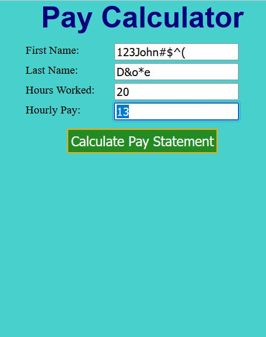
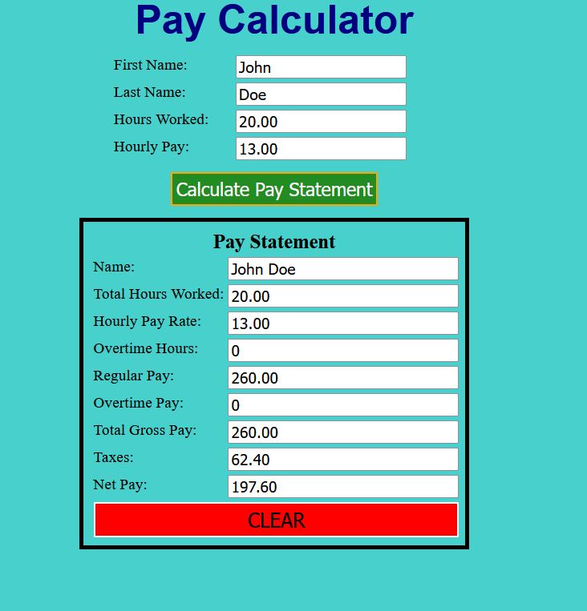

# Income-Calculator
Simple app built with ASP.NET 4.7 to calculate weekly earnings

## Technologies
  - C#
  - ASP.NET
  - Web Forms
  - CSS

## Application Information
This is an app which can calculate the weekly earnings of an employee.
It will show taxes paid, net income, gross income, and overtime pay.

### Solutions and Architecture

I ensured data was validated so the application wouldn't crash if any
unexpected characters were entered.

For the name, I used a regular expression which only accepted alphabetical
characters and hyphens.

For the numbers (hours and pay rate) I converted it into a decimal number
to calculate the total pay.

When determining the pay, I split the code so it would calculate OT pay if 
the hours were greater than 40 using an if/else statement. I added code that applied to both
below the conditional statements to reduce the amount of code being re-written when the 
calculation would be the same.

### Lessons Learned

This was my first "real" app with C# so it was a little bit new to me but I
picked it up quickly since it's programming at the end of the day. Coming 
from a TypeScript background, the strongly typed language didn't phase me.

### Pictures of the app

#### Before Submission

#### After Submission

